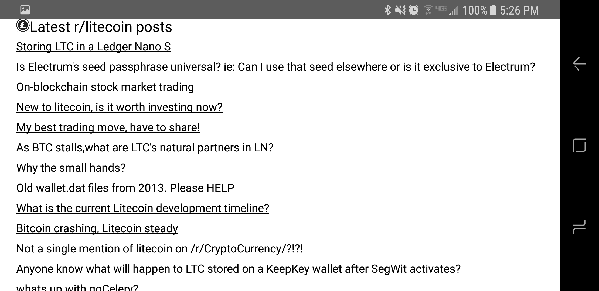
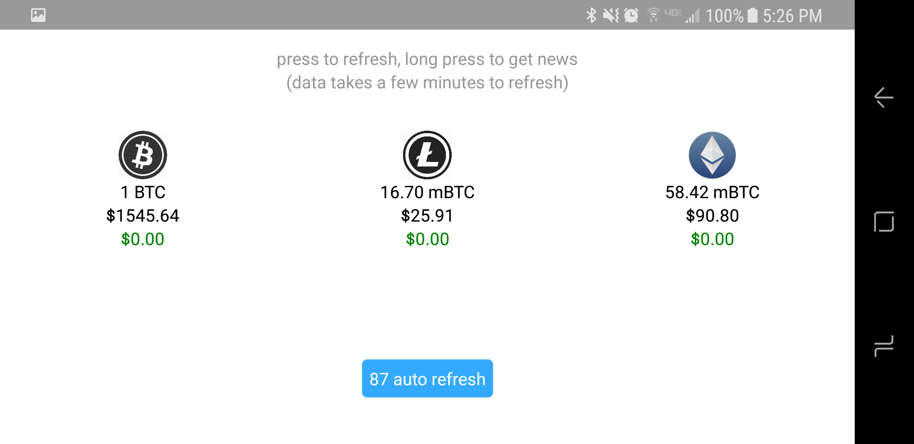

## React-Native-Crypto-Ticker
This project was bootstrapped with [Create React Native App](https://github.com/react-community/create-react-native-app).

A simple Coinbase crypto ticker that shows price data for BTC, LTC, and ETH, and the newest reddit posts for each currency.

## Download the Android APK

   [APK](https://exp-shell-app-assets.s3-us-west-1.amazonaws.com/android%2F%40mpint%2Fcryptoticker-db59d384-31d5-11e7-9ad4-0a580a780517-signed.apk)

## Getting started

```
npm install
npm start
```

## Screenshots

Ticker


News
